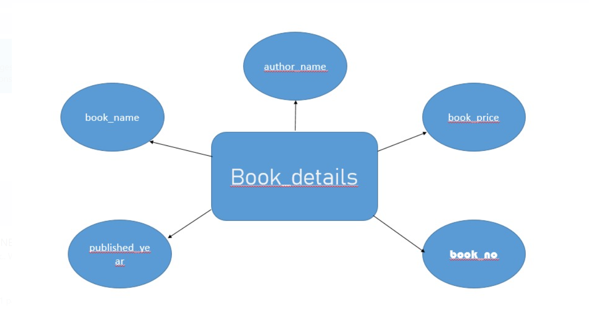

# Ex02 Django ORM Web Application
## Date: 02-04-2024
## Name: Mugil Raj S A
## Reg.no: 212223220062
## Dept: IT

## AIM
To develop a Django application to store and retrieve data from a Book database using Object Relational Mapping(ORM).

## Entity Relationship Diagram




## DESIGN STEPS

### STEP 1:
Clone the problem from GitHub

### STEP 2:
Create a new app in Django project

### STEP 3:
Enter the code for admin.py and models.py

### STEP 4:
Execute Django admin and create details for 10 books

## PROGRAM
```
admin.py

from django.contrib import admin
from .models import Book,Display_book
admin.site.register (Book, Display_book)

models.py

from django.db import models
from django.contrib import admin
class Book(models.Model):
    book_id = models.IntegerField(primary_key=True)
    book_name = models.CharField(max_length=100)
    Author= models.CharField(max_length=50)
    Date= models.DateField()
    price = models.IntegerField()

class Display_book(admin.ModelAdmin):
    list_display = ('book_id','book_name','Author','Date','price')
````

## OUTPUT


## RESULT
Thus the program for creating a database using ORM hass been executed successfully
